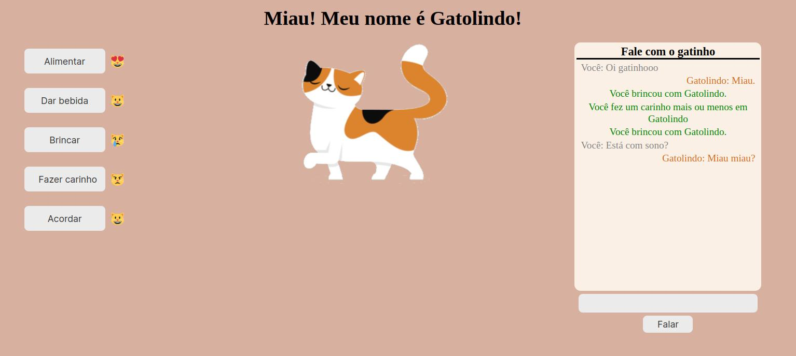

# Boas Vindas ao projeto do Gatinho Virtual

# O que é este projeto?

O projeto do Gato Virtual é inspirado no Tamagochi, e é composto de duas páginas web. Na primeira, você dá um nome para o gato, e na segunda página tem as interações com ele.
A segunda tela possui 5 botões de interação com o gato além de um chat, onde é possível conversar com o gato.
Cada botão de interação conta com uma reação do gato à atividade realizada, representada por um emoji. As interações disponíveis são:

- Alimentar - selecione um alimento para dar ao gato;
- Dar bebida - selecione uma bebida para dar ao gato;
- Brincar - selecione um brinquedo para o gato;
- Fazer carinho - faça um carinho ruim, mais ou menos, bom ou perfeito no gato;
- Acordar - acorde o gato se ele estiver dormindo, ou o coloque para dormir se ele estiver acordado. Lembrando que as outras interações ficam indisponíveis quando o gato está acordado.

# Como utilizar este projeto?

Você pode acessar este projeto [clicando aqui](https://lelepg.github.io/Virtual-Cat/index.html).
De maneira alternativa você também pode fazer o download deste repositório cloando-o ou baixando em formato _.zip_.
Caso opte por baixar em _.zip_, descompacte o arquivo baixado e abra o arquivo **index.html** clicando duas vezes sobre ele. Isso abrirá a página inicial, onde o nome do gato deve ser escolhida. Depois de nomear o gato, clique em iniciar para ter acesso à página de interações.

### Tecnologias utilizadas

- HTML;
- CSS;
- Javascript.

### Links externos:

- [Emojis](https://unicode.org/emoji/charts/full-emoji-list.html)
- [Imagem original utilizada para o gato](https://fi.pinterest.com/pin/863706034772772147/)
